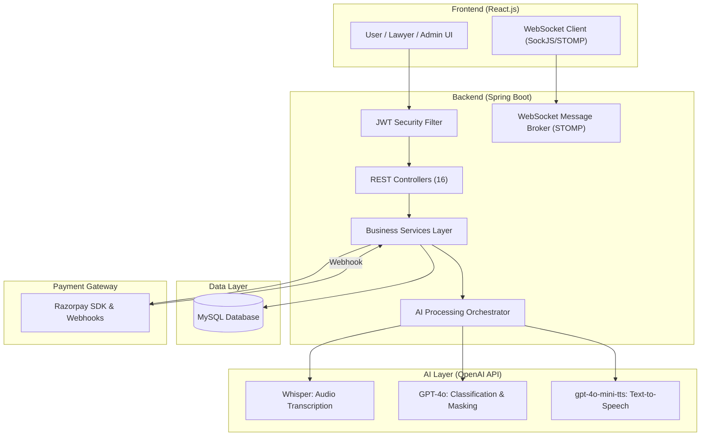
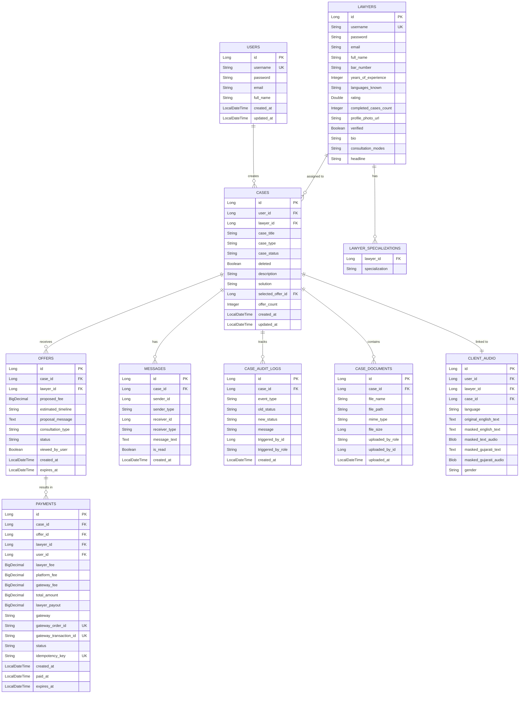
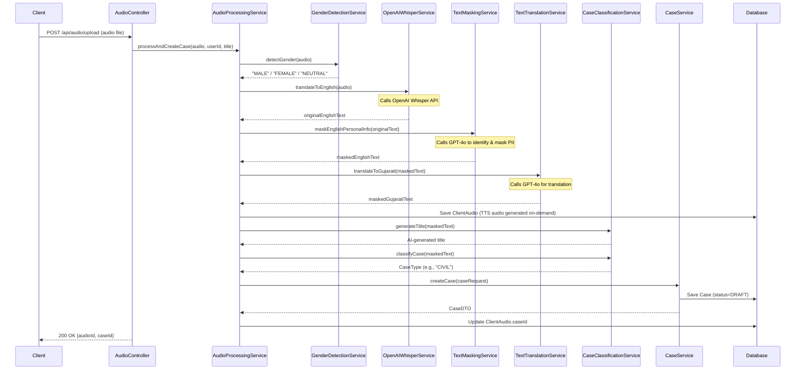
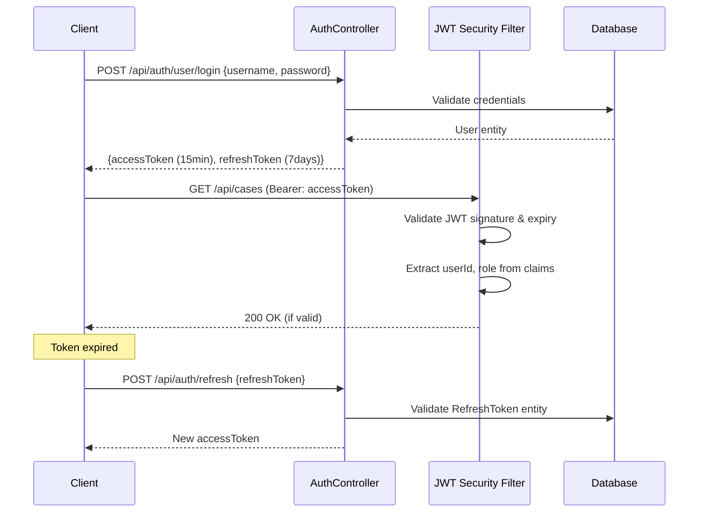

# Detailed Design Document (DDD): LegalConnect

**Version**: 1.0
**Date**: March 2026
**Author**: Engineering Team

---

## 1. System Overview

LegalConnect is a full-stack legal marketplace platform connecting clients with lawyers. It employs a multi-tier architecture with a **React.js SPA** frontend, a **Spring Boot REST API** backend, a **MySQL** relational database, and deep **OpenAI API** integrations for audio transcription, classification, text masking, translation, and speech synthesis.

---

## 2. High-Level Architecture



---

## 3. Data Model Design

### 3.1 Entity Relationship Diagram



---

### 3.2 Key Entity Definitions

| Entity | Table | Purpose |
|---|---|---|
| `User` | `users` | Client accounts with auth credentials |
| `Lawyer` | `lawyers` | Verified legal professionals with profile data |
| `Case` | `cases` | Core legal request entity; central to all workflows |
| `Offer` | `offers` | Lawyer bids on a published case (unique per lawyer) |
| `Payment` | `payments` | Full transaction record with Razorpay gateway data |
| `ClientAudio` | `client_audio` | AI-processed audio blobs, transcription, and translations |
| `Message` | `messages` | P2P messages between client and lawyer on a case |
| `CaseAuditLog` | `case_audit_logs` | Immutable log entry for every case state transition |
| `CaseDocument` | `case_documents` | Secure file vault for legal documents |
| `Admin` | `admins` | Platform administrators |
| `Appointment` | `appointments` | Scheduled consultation slots |
| `AuditLog` | `audit_logs` | System-wide admin audit trail |

---

### 3.3 Enumerations

**`CaseStatus` (Case Lifecycle)**

```
DRAFT → PUBLISHED → UNDER_REVIEW → PAYMENT_PENDING → IN_PROGRESS → CLOSED
                                  ↘ PAYMENT_FAILED (retry) ↗
                                  ↘ ON_HOLD
```

| Status | Description |
|---|---|
| `DRAFT` | AI-generated; awaiting user review & publish |
| `PUBLISHED` | Visible to lawyers in Discovery Pool |
| `UNDER_REVIEW` | Has incoming offers; user reviewing |
| `PAYMENT_PENDING` | Offer accepted; Razorpay order created, awaiting payment |
| `PAYMENT_FAILED` | Payment expired or failed |
| `IN_PROGRESS` | Payment confirmed; lawyer actively working |
| `CLOSED` | Case resolved |
| `ON_HOLD` | Temporarily paused |
| `VERIFIED` | Verified by admin |

**`CaseType`** (13 categories):
`CRIMINAL`, `CIVIL`, `FAMILY`, `CORPORATE`, `INTELLECTUAL_PROPERTY`, `REAL_ESTATE`, `PROPERTY`, `LABOR`, `TAX`, `CYBER`, `CYBER_CRIME`, `IMMIGRATION`, `OTHER`

**`OfferStatus`**: `SUBMITTED`, `ACCEPTED`, `REJECTED`, `EXPIRED`

**`PaymentStatus`**: `PENDING`, `PAID`, `FAILED`, `REFUNDED`, `DISPUTED`

---

## 4. AI Processing Pipeline

The core differentiator of LegalConnect is its 7-stage AI pipeline orchestrated by `AudioProcessingService`.



### 4.1 AI Service Responsibilities

| Service | OpenAI API Used | Function |
|---|---|---|
| `OpenAIWhisperService` | `whisper-1` | Transcribes audio to English text |
| `GenderDetectionService` | `gpt-4o-mini` | Classifies speaker gender from audio context |
| `TextMaskingService` | `gpt-4o` | Identifies and replaces PII (names, addresses, phones) |
| `TextTranslationService` | `gpt-4o` | Translates masked English text to Gujarati |
| `CaseClassificationService` | `gpt-4o` | Assigns `CaseType` enum and generates a descriptive title |
| `OpenAITextToSpeechService` | `gpt-4o-mini-tts` | Generates MP3 audio summaries on-demand |

### 4.2 TTS Voice Selection Logic

Audio is generated **on-demand** (not at upload time) to save costs. The `TTSController` is a **caching proxy** — checks for cached audio in `ClientAudio` first, only calls OpenAI TTS if no cache.

| Language | Gender | Voice |
|---|---|---|
| English | MALE | `cedar` |
| English | FEMALE | `coral` |
| English | NEUTRAL | `ash` |
| Gujarati | MALE | `onyx` |
| Gujarati | FEMALE | `coral` |
| Gujarati | NEUTRAL | `nova` |

**Model**: `gpt-4o-mini-tts` | **Format**: MP3 | **Speed**: 0.98x

---

## 5. API Design

### 5.1 Base URL & Authentication

All endpoints are prefixed with `/api`. JWT Bearer token is required for all protected routes.

```
Authorization: Bearer <jwt_token>
```

### 5.2 REST API Endpoints

#### Authentication (`/api/auth`)

| Method | Endpoint | Access | Description |
|---|---|---|---|
| POST | `/api/auth/user/register` | Public | Register a new client |
| POST | `/api/auth/user/login` | Public | Login for clients |
| POST | `/api/auth/lawyer/register` | Public | Register a new lawyer |
| POST | `/api/auth/lawyer/login` | Public | Login for lawyers |
| POST | `/api/auth/admin/login` | Public | Admin login |
| POST | `/api/auth/refresh` | Public | Refresh JWT access token |

#### Cases (`/api/cases`)

| Method | Endpoint | Access | Description |
|---|---|---|---|
| POST | `/api/cases` | USER | Create a new case |
| GET | `/api/cases/{id}` | USER, LAWYER | Get case by ID (access-controlled) |
| PUT | `/api/cases/{caseId}` | USER | Update case details |
| PUT | `/api/cases/{caseId}/publish` | USER | Publish draft case to lawyers |
| PUT | `/api/cases/{caseId}/status` | USER, LAWYER | Update case status |
| PUT | `/api/cases/{caseId}/solution` | LAWYER | Submit case solution |
| POST | `/api/cases/{caseId}/assign` | ADMIN | Assign lawyer to case |
| POST | `/api/cases/{caseId}/accept` | USER | Accept case request from lawyer |
| POST | `/api/cases/{caseId}/decline` | USER | Decline case request |
| DELETE | `/api/cases/{caseId}` | USER | Soft-delete a case |
| GET | `/api/cases/user/{userId}` | USER (self) | Get all cases for a user |
| GET | `/api/cases/lawyer/{lawyerId}` | LAWYER (self) | Get all cases for a lawyer |
| GET | `/api/cases/unassigned` | LAWYER, ADMIN | Discovery Pool — unassigned published cases |
| GET | `/api/cases/recommended/{lawyerId}` | LAWYER | Specialization-matched cases |

#### Audio Processing (`/api/audio`)

| Method | Endpoint | Access | Description |
|---|---|---|---|
| POST | `/api/audio/upload` | USER | Upload audio; triggers full AI pipeline |
| GET | `/api/audio/user/{userId}` | USER | Fetch all processed audio for a user |
| GET | `/api/audio/lawyer/{lawyerId}` | LAWYER | View audios for assigned/spec-matched cases |
| GET | `/api/audio/admin` | ADMIN | View all audio records |

#### Text-to-Speech (`/api/tts`)

| Method | Endpoint | Access | Description |
|---|---|---|---|
| POST | `/api/tts/generate` | LAWYER, USER | On-demand TTS (cached in DB). Body: `{caseId, language}` |

Returns Base64-encoded MP3 audio with `{audio, language, gender}`.

#### Offers (`/api/offers`, `/api/user/offers`)

| Method | Endpoint | Access | Description |
|---|---|---|---|
| POST | `/api/offers` | LAWYER | Submit an offer for a case |
| GET | `/api/offers/case/{caseId}` | USER, LAWYER | Get offers for a case |
| PUT | `/api/offers/{offerId}/accept` | USER | Accept a lawyer's offer |
| PUT | `/api/offers/{offerId}/reject` | USER | Reject a lawyer's offer |
| GET | `/api/user/offers/{userId}` | USER | View all offers received on user's cases |

#### Payments (`/api/payments`)

| Method | Endpoint | Access | Description |
|---|---|---|---|
| POST | `/api/payments/create` | USER | Create Razorpay order (triggers `PAYMENT_PENDING`) |
| POST | `/api/payments/verify` | USER | Verify payment signature |
| POST | `/api/payments/webhook` | System | Razorpay webhook for server-side confirmation |
| GET | `/api/payments/case/{caseId}` | USER, LAWYER | Get payment details for a case |

#### Messaging & WebSocket

| Method | Endpoint | Access | Description |
|---|---|---|---|
| POST | `/api/messages/send` | USER, LAWYER | Send a message in a case chat |
| GET | `/api/messages/case/{caseId}` | USER, LAWYER | Get message history |
| WS | `/topic/case.{caseId}` | USER, LAWYER | Real-time message broadcast (STOMP) |

#### Documents & Timeline

| Method | Endpoint | Access | Description |
|---|---|---|---|
| POST | `/api/documents/upload` | USER, LAWYER | Upload a file to a case's Document Vault |
| GET | `/api/documents/case/{caseId}` | USER, LAWYER | List documents with metadata |
| GET | `/api/documents/{docId}/download` | USER, LAWYER | Secure file download |
| GET | `/api/cases/{caseId}/timeline` | USER, LAWYER | Fetch ordered audit log (case timeline) |

#### Lawyers & Bookings

| Method | Endpoint | Access | Description |
|---|---|---|---|
| GET | `/api/lawyers` | USER | List/search verified lawyers |
| GET | `/api/lawyers/{id}` | USER | Get full lawyer profile |
| PUT | `/api/lawyers/{id}/profile` | LAWYER | Update own profile |
| POST | `/api/bookings` | USER | Book a consultation appointment |
| GET | `/api/bookings/user/{userId}` | USER | Get user's appointments |
| GET | `/api/bookings/lawyer/{lawyerId}` | LAWYER | Get lawyer's appointments |

#### Admin (`/api/admin`)

| Method | Endpoint | Access | Description |
|---|---|---|---|
| GET | `/api/admin/users` | ADMIN | List all users |
| GET | `/api/admin/lawyers` | ADMIN | List all lawyers |
| GET | `/api/admin/cases` | ADMIN | List all cases |
| PUT | `/api/admin/lawyers/{id}/verify` | ADMIN | Approve/verify a lawyer |
| DELETE | `/api/admin/users/{id}` | ADMIN | Delete a user |
| GET | `/api/admin/payments` | ADMIN | View all transactions |

---

## 6. Security Architecture

### 6.1 Authentication Flow



### 6.2 Authorization Model (RBAC)

| Role | Accessible Resources |
|---|---|
| `user` | Own cases, own audio, offers on own cases, payments, chat on own cases |
| `lawyer` | Assigned cases, Discovery Pool (specialty filtered), own offers, chat on assigned cases |
| `admin` | All resources unconditionally |

### 6.3 Key Security Features

- **JWT + Refresh Token**: Short-lived access tokens (15 min) with DB-validated refresh tokens.
- **PII Masking**: All personal identifiers replaced by AI before sharing with lawyers.
- **Soft Deletes**: Cases use `deleted = true` flag; never permanently removed.
- **Offer Uniqueness**: DB-level `UNIQUE(case_id, lawyer_id)` prevents duplicate bids.
- **Idempotency Keys**: Payments use unique keys to prevent double charges.
- **Webhook Signature Verification**: Razorpay payloads are HMAC-SHA256 verified.
- **Rate Limiting**: `RateLimitService` prevents API abuse.

---

## 7. Payment Design

### 7.1 Fee Breakdown

| Component | Value | Who Pays / Receives |
|---|---|---|
| `lawyerFee` | Offer's proposed fee (e.g., ₹10,000) | Lawyer's asking price |
| `platformFee` | 10% of lawyerFee (e.g., ₹1,000) | Withheld by platform |
| `gatewayFee` | ~2% Razorpay charge (e.g., ₹200) | Paid to Razorpay |
| `totalAmount` | lawyerFee + gatewayFee (e.g., ₹10,200) | **Total user pays** |
| `lawyerPayout` | lawyerFee − platformFee (e.g., ₹9,000) | **Net lawyer receives** |

### 7.2 Payment Flow

```
User accepts Offer
     ↓
POST /api/payments/create → Creates Payment(PENDING) + Razorpay Order
     ↓
Frontend loads Razorpay Checkout (gatewayOrderId)
     ↓
User completes payment
     ↓
POST /api/payments/verify → Signature checked → Payment(PAID) + Case(IN_PROGRESS)
     ↓ (server-side confirmation via webhook)
POST /api/payments/webhook → Razorpay event → Payment.paidAt set, Offer(ACCEPTED)
```

---

## 8. Frontend Architecture

### 8.1 Key Components

| Component | Purpose |
|---|---|
| `LandingPage.js` | Public marketing page |
| `UserDashboard.js` | Client's case overview and management |
| `LawyerDashboard.js` | Lawyer's active cases, discovery pool, audio playback |
| `AdminDashboard.js` | Full system management panel |
| `CaseDetail.js` | Detailed view: description, timeline, documents, chat, TTS |
| `CaseDraftPreview.js` | Preview AI-generated case before publishing |
| `AudioRecorder.js` | Record/upload audio in-browser |
| `LawyerSearch.js` | Search with specialization/rating filters |
| `SubmitOfferForm.js` | Lawyer's offer submission form |
| `RazorpayCheckout.js` | Razorpay payment integration wrapper |
| `UserCaseMessages.js` | Real-time chat interface |

### 8.2 State Management

- **Auth**: `React Context API` stores JWT token, role, and user ID.
- **API Calls**: Axios interceptors automatically attach Bearer tokens.
- **Real-time Chat**: SockJS + StompJS subscribes to `/topic/case.{caseId}`.

---

## 9. Database Design Constraints

| Constraint | Table | Detail |
|---|---|---|
| Unique Username | `users`, `lawyers` | Prevents duplicate accounts per role |
| Unique Offer | `offers` | `UNIQUE(case_id, lawyer_id)` — one bid per lawyer per case |
| Unique Order ID | `payments` | `gateway_order_id` unique — idempotent payment orders |
| Unique Transaction | `payments` | `gateway_transaction_id` unique — prevents replay attacks |
| Unique Idempotency Key | `payments` | Application-level idempotency guard |
| Soft Delete | `cases` | `deleted` boolean flag; no real `DELETE` |
| Offer Expiry | `offers` | Auto-set `expires_at = created_at + 48 hours` |
| Payment Expiry | `payments` | Auto-set `expires_at = created_at + 24 hours` |

---

## 10. Error Handling Strategy

| Exception | HTTP Status | Usage |
|---|---|---|
| `ResourceNotFoundException` | 404 | Entity not found in DB |
| `UnauthorizedException` | 401 / 403 | JWT invalid or role mismatch |
| `BadRequestException` | 400 | Invalid state transitions or bad input |
| `AudioProcessingException` | 500 | AI pipeline failure |
| General `RuntimeException` | 500 | Unhandled errors |

All errors are logged via SLF4J (`logback`) with structured context (entity ID, user, action).
